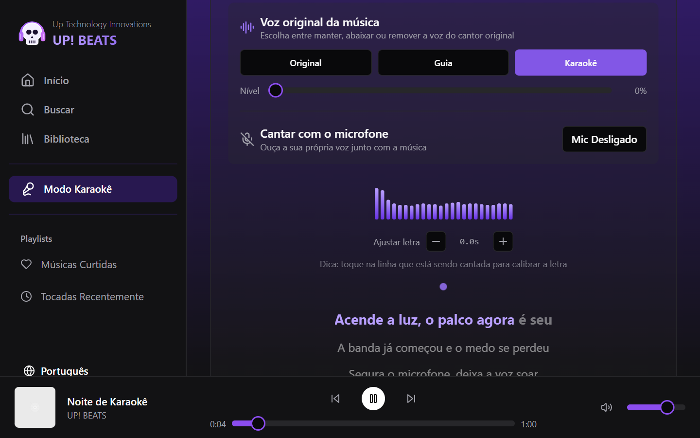

# UP! BEATS Karaokê

[](https://github.com/renanfrontend/upbeats-karaoke-player/actions/workflows/deploy.yml)

**Demo:** https://renanfrontend.github.io/upbeats-karaoke-player/

> © 2025–2026 Renan Augusto dos Santos. **Todos os direitos reservados.** Código público apenas para avaliação de portfólio: copiar, adaptar ou reutilizar exige autorização por escrito. Veja [Licença e direitos autorais](#licença-e-direitos-autorais).



Karaokê que roda direto no navegador: busque uma música, acompanhe a **letra sincronizada**, tire a **voz original em tempo real** e cante com o **seu microfone**, com eco e retorno de áudio. Todo o processamento acontece no próprio aparelho, sem servidor de áudio.

## O que dá para fazer

- **Buscar músicas** e abrir qualquer faixa no modo karaokê (prévias de 30 s da API do iTunes).
- **Cantar com a letra sincronizada** linha a linha (LRCLIB). Se a letra estiver adiantada ou atrasada, basta tocar na linha que está sendo cantada para calibrar. O ajuste fica salvo por música.
- **Controlar a voz original**: *Original*, *Guia* (voz baixinha, só para orientar) ou *Karaokê* (voz removida), com um controle fino de nível.
- **Cantar com o microfone** ouvindo a própria voz junto com a música, com volume, eco e medidor de nível. Há dois modos: **caixas de som** (cancelamento de eco ligado, para evitar microfonia) e **fones** (voz mais natural).
- **Cantar com a sua música**: abra um arquivo do seu aparelho para tocar a faixa inteira. Como o arquivo é local, o controle de voz sempre funciona.
- Interface em **português, inglês e espanhol**, com músicas curtidas e tocadas recentemente.

## Stack

React 18 · TypeScript · Vite 5 · Web Audio API · Tailwind CSS · shadcn/ui · TanStack Query (cache das buscas e das letras) · React Router (HashRouter, compatível com GitHub Pages) · i18next (pt-BR, en, es) · GitHub Actions + GitHub Pages.

## Arquitetura

```
src/
├── audio/karaokeEngine.ts   # grafo da Web Audio API: remoção de voz, mixagem, microfone e análise
├── context/PlayerContext.tsx # player global: faixa atual, fila, tempo e volume
├── services/spotifyApi.ts   # busca e prévias do iTunes, letras do LRCLIB (o nome do arquivo é herdado)
├── pages/                   # Início, Busca, Biblioteca e Karaokê (as três últimas sob demanda)
├── components/
│   ├── karaoke/             # KaraokePlayer (letra), VoiceControls e AudioVisualizer
│   ├── layout/              # AppLayout, menu lateral, player inferior e logo
│   ├── music/               # cards e listas de músicas
│   └── ui/                  # componentes shadcn/ui
└── i18n/                    # i18next e traduções (pt-BR, en, es)
brand/                       # kit do logo em SVG e PNG
```

### Como a remoção de voz funciona

Todo o áudio passa por **um único grafo da Web Audio API** (`src/audio/karaokeEngine.ts`), então a música e o microfone são mixados pelo próprio navegador e ficam sincronizados:

```text
<audio> ─► fonte ─┬─► original ─────────────────────────────┐
                  ├─► (E − D) lateral ──┐                    │
                  ├─► passa-baixa 130 Hz ┼─► instrumental ───┤
                  └─► passa-alta 8,5 kHz ┘                   ├─► música ─┐
                                                                         ├─► saída
mic ─► fonte ─► passa-alta 80 Hz ─► compressor ─► ganho ─┬─► seco ─┐     │
                                                         └─► eco ──┴─► mic ┘
```

- A voz principal quase sempre fica **no centro do estéreo** (igual nos dois canais). Subtrair o canal direito do esquerdo (E − D) cancela a voz e mantém os instrumentos abertos nas laterais.
- Grave e bumbo também ficam no centro, então eles voltam por filtros em cascata (4ª ordem) que ficam fora da faixa da voz, junto com o brilho dos pratos.
- O controle de voz faz um *crossfade* entre a mixagem original e a instrumental, mantendo o volume constante. Mudanças usam rampas curtas para não estalar.
- No microfone: corte de graves e plosivas, compressor contra picos e microfonia, e um *delay* com realimentação para o eco de "salão de karaokê".

**Limitação conhecida:** a técnica depende de a voz estar no centro da mixagem. Em gravações com voz estéreo, efeitos largos ou ao vivo, sobra um pouco da voz original. Prévias de streaming de outros domínios também podem bloquear o processamento de áudio (CORS); para esses casos existe o "Cantar com minha música".

## Rodando localmente

```bash
npm ci
npm run dev
```

O app abre em `http://localhost:8080/upbeats-karaoke-player/`. O microfone exige `localhost` ou HTTPS (regra dos navegadores para `getUserMedia`).

| Script | O que faz |
| --- | --- |
| `npm run build` | Build de produção em `dist/` |
| `npm run lint` | ESLint |
| `npm run preview` | Serve o build local |

Cada push na `main` publica no GitHub Pages (`.github/workflows/deploy.yml`).

## Dados de terceiros

- [iTunes Search API](https://performance-partners.apple.com/search-api): busca, capas e prévias de 30 s.
- [LRCLIB](https://lrclib.net): letras sincronizadas, API aberta.

Músicas, capas e letras pertencem aos seus respectivos donos e são exibidas só como demonstração. A captura acima usa uma faixa sintetizada e uma letra criadas para o projeto.

## Marca

O logo fica em [`brand/`](brand), em vetor (`svg/`) e PNG com fundo transparente (`png/`):

- **Ícone**, **horizontal** (ícone + nome) e **empilhado** (ícone em cima), cada um em versão para fundo escuro e para fundo claro (com contorno escuro na caveira).
- O texto "UP! BEATS" está em contorno vetorial (Montserrat Black, licença OFL): não depende de fonte instalada.
- No app: `public/logo.svg` (menu), `public/favicon.svg` e `favicon.png` (aba do navegador) e `public/apple-touch-icon.png` (atalho no iPhone, com fundo sólido).

## Autoria

Concepção, marca UP! BEATS, processamento de áudio e evolução do app por **Renan Augusto dos Santos** ([renanaugusto.com.br](https://renanaugusto.com.br) · [contato@renanaugusto.com.br](mailto:contato@renanaugusto.com.br)), da Up Technology Innovations. A base inicial foi gerada com o Lovable, ferramenta de desenvolvimento com IA, e o projeto seguiu com apoio de IA.

## Licença e direitos autorais

© 2025–2026 Renan Augusto dos Santos. **Todos os direitos reservados.**

Este não é um projeto open source. O código está público apenas para fins de portfólio e avaliação profissional. Sem autorização por escrito, não é permitido:

- copiar, modificar, redistribuir ou usar comercialmente o projeto, no todo ou em parte;
- reescrever o projeto em outra stack a partir deste repositório, ou reutilizar o processamento de áudio, a marca UP! BEATS, a interface e os textos;
- apresentar o projeto, ou parte dele, como trabalho próprio em portfólios, processos seletivos ou propostas comerciais;
- usar o conteúdo do repositório ou da demo para treinar ou avaliar modelos de IA.

Os termos completos estão em [LICENSE](LICENSE). Dependências, fontes e os dados de terceiros listados acima mantêm suas próprias licenças. Pedidos de autorização: [contato@renanaugusto.com.br](mailto:contato@renanaugusto.com.br).

---

## 🇺🇸 English

UP! BEATS Karaoke is a browser karaoke app by **Renan Augusto dos Santos**: search for a song, follow time-synced lyrics, remove the original vocals in real time and sing along with your own microphone, with echo and monitoring. Everything runs on the device through a single Web Audio API graph (left-minus-right vocal cancellation plus filtered bass and highs, a crossfade between original and instrumental, and a mic chain with compressor and echo). Built with React 18, TypeScript, Vite, TanStack Query and i18next (Portuguese, English and Spanish). Song data comes from the iTunes Search API and lyrics from LRCLIB; they belong to their respective owners.

© 2025–2026 Renan Augusto dos Santos. All rights reserved. This is not open source. The source is public for portfolio evaluation only; copying, modifying, porting, redistributing, commercial use, presenting it as your own work or using it to train AI models requires written permission. See [LICENSE](LICENSE). Contact: [contato@renanaugusto.com.br](mailto:contato@renanaugusto.com.br) · [renanaugusto.com.br](https://renanaugusto.com.br).
